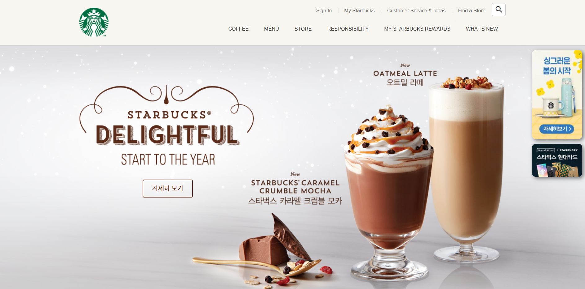

# Starbucks
스타벅스 홈페이지 `clone coding`  
HTML, CSS, JS를 이용한 간단한 디자인 및 동적효과 부여  
[바로가기](https://eloquent-roentgen-4a3a79.netlify.app)


# GSAP & ScrollToPlugin
자바스크립트로 제어하는 타임라인 기반의 애니메이션 라이브러리 [GSAP(The GreenSock Animation Platform)](https://greensock.com/gsap/)와 스크롤 애니메이션을 제공하는 [ ScrollToPlugin](https://greensock.com/scrolltoplugin/) 활용.
```html
<script src="https://cdnjs.cloudflare.com/ajax/libs/gsap/3.5.1/gsap.min.js" integrity="sha512-IQLehpLoVS4fNzl7IfH8Iowfm5+RiMGtHykgZJl9AWMgqx0AmJ6cRWcB+GaGVtIsnC4voMfm8f2vwtY+6oPjpQ==" crossorigin="anonymous"></script>
<script src="https://cdnjs.cloudflare.com/ajax/libs/gsap/3.5.1/ScrollToPlugin.min.js" integrity="sha512-nTHzMQK7lwWt8nL4KF6DhwLHluv6dVq/hNnj2PBN0xMl2KaMm1PM02csx57mmToPAodHmPsipoERRNn4pG7f+Q==" crossorigin="anonymous"></script>
```
# Swiper
하드웨어 가속 전환과 여러 기본 동작을 갖춘 현대적인 슬라이드 라이브러리 [Swiper](https://swiperjs.com/) 참고. 해당 프로젝트에서는 6.8.4 버전 사용.
```html
<link rel="stylesheet" href="https://unpkg.com/swiper@6.8.4/swiper-bundle.min.css"/>
  <script src="https://unpkg.com/swiper@6.8.4/swiper-bundle.min.js"></script>
```
# Youtube API
[IFrame Player API](https://developers.google.com/youtube/iframe_api_reference?hl=ko)를 통해 YouTube 동영상을 제어.
```html
<script defer src="./js/yotube.js"></script>
```
# Lodash
다양한 유틸리티를 제공하는 js 라이브러리 [lodash](https://lodash.com/) 활용.
```html
<script src="https://cdnjs.cloudflare.com/ajax/libs/lodash.js/4.17.21/lodash.min.js" integrity="sha512-WFN04846sdKMIP5LKNphMaWzU7YpMyCU245etK3g/2ARYbPK9Ub18eG+ljU96qKRCWh+quCY7yefSmlkQw1ANQ==" crossorigin="anonymous" referrerpolicy="no-referrer"></script>
```
# ScrollMagic
스크롤과 요소의 상호 작용을 위한 js 라이브러리 [ScrollMagic](http://scrollmagic.io/docs/).
대표적으로 어떤 요소가 현재 화면에 보이는 상태인지를 확인할 때 주로 사용.
```html
<script src="https://cdnjs.cloudflare.com/ajax/libs/ScrollMagic/2.0.8/ScrollMagic.min.js"></script>
```
```javascript
new ScrollMagic
  .Scene({ // 감시할 장면(Scene) 추가
    triggerElement: spyEl, // 보여짐 여부를 감시할 요소를 지정
    triggerHook: .7 // 화면의 70% 지점에서 보여짐 여부 감시
  })
  .setClassToggle(spyEl, 'show') // 요소가 화면에 보이면 show 클래스 추가
  .addTo(new ScrollMagic.Controller()) // 컨트롤러에 장면을 할당(필수)
```